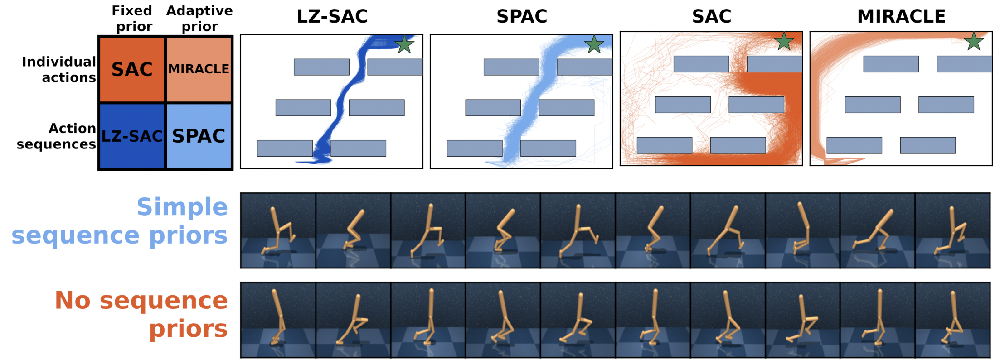

# Repository for our paper Reinforcement Learning with Simple Sequence priors

By Tankred Saanum, Noemi Elteto, Peter Dayan, Marcel Binz, and Eric Schulz. You can find our paper [here](https://papers.neurips.cc/paper_files/paper/2023/file/c3909e3abe8ebdb20c42a42ce0bc907d-Paper-Conference.pdf).

This repository contains code for running both the LZ-SAC RL agent and the SPAC agent, along with baselines, in the DeepMind Control Suite and MetaWorld.

## Abstract

> Everything else being equal, simpler models should be preferred over more complex ones. In reinforcement learning (RL), simplicity is typically quantified on an action-by-action basis -- but this timescale ignores temporal regularities, like repetitions, often present in sequential strategies. We therefore propose an RL algorithm that learns to solve tasks with sequences of actions that are compressible. We explore two possible sources of simple action sequences: Sequences that can be learned by autoregressive models, and sequences that are compressible with off-the-shelf data compression algorithms. Distilling these preferences into sequence priors, we derive a novel information-theoretic objective that incentivizes agents to learn policies that maximize rewards while conforming to these priors. We show that the resulting RL algorithm leads to faster learning, and attains higher returns than state-of-the-art model-free approaches in a series of continuous control tasks from the DeepMind Control Suite. These priors also produce a powerful information-regularized agent that is robust to noisy observations and can perform open-loop control.

